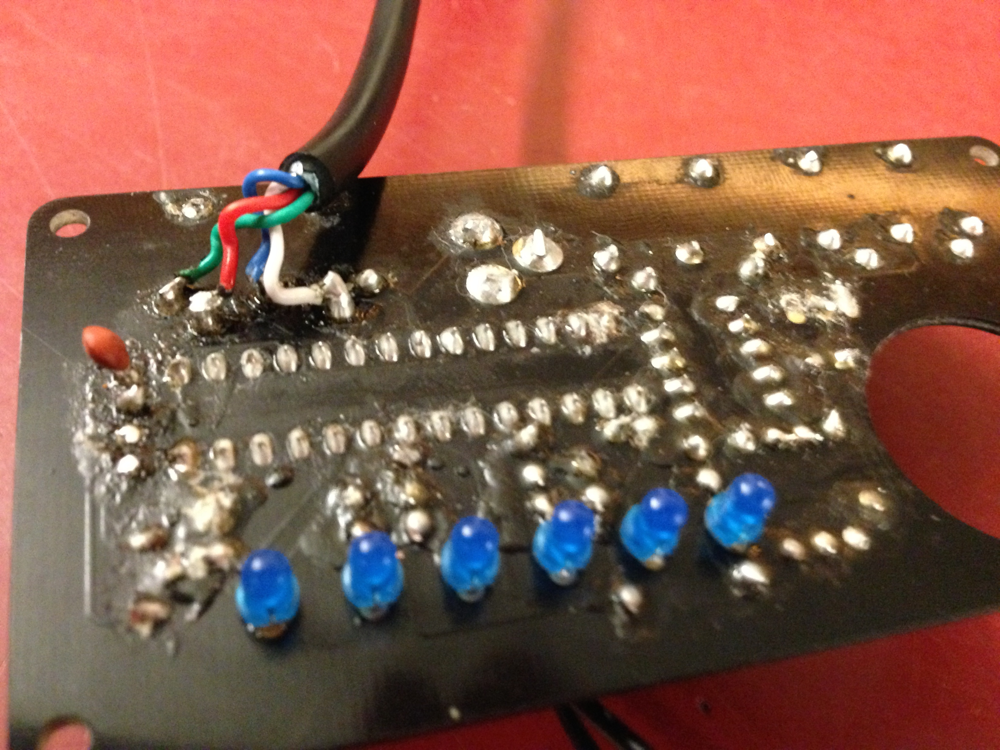

##The Idea
When encrypting files, because we often work with the raw byte data, we break the file format. This renders them illegible. This script is intended to encrypt files without destroying their original filetype. Currently only images are supported. However after encryption an Image you will be able to open it up and look at the result!

This script is intended for educational purposes. Being able to look at an image after encryption and see patterns and trends can be a fun way to view an encryption. 

**THIS IS NOT INTENDED TO BE A SECURE ENCRYPTION SCRIPT**

That said, crypto errors within the scope of the concept should definitely be snuffed out.

##Current Limitations
####Format Support
Right now the script only works with images and only encrypts them with AES in ECB mode. It is the goal to have the script support selection of many encryption types so that one may visually see result. 
####Speed
Another issue is speed. Currently the code encrypts each pixel individually rather than chunking the file up or using some sort of compression. This means that it takes a very long time to encrypt images. Speeding this up is on the to-do list.
####Decryption
The current method of Encryption generates numbers which must have a modulus taken. This loses information and breaks the decryption of the file. While the program would serve it's purpose without decryption support, I would still like to implement it.

##Dependencies
The program was written and tested on python 2.7.5. It makes use of the PyCrypto library and the Python Imaging Library(PIL). To install these, it should work to run

<code>
pip install pycrypto 
pip install pil
</code>

Bootstrap file soon&#8482;

##Example I/O
The original image

The same image encrypted pixel by pixel using AES in ECB mode with the uninspiring password "password".

